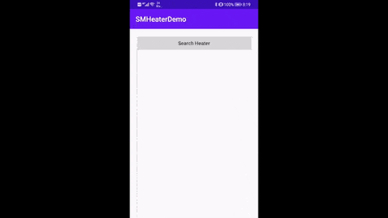

# Introduce

   

A Android SDK and Demo to Control SIMO Heater via BLE.



# How to use

## 1. Add Codes In build.gradle(Global or App)

Add the codes below in file `build.gradle(YOUR_PROJECT_NAME)` to import SMHeaterSDK in all module:

```
allprojects {
	repositories {
		google()
		jcenter()
		
		// Add this Absolute Address
		maven { url "https://raw.githubusercontent.com/Shenzhen-Simo-Technology-co-LTD/SMHeaterDemo/master" }
    }
}
```

Or 


Add the codes below in file `build.gradle(YOUR_MODULE)` to import SMHeaterSDK in only YOUR_MODULE:

```
android {
	...
	repositories {
        maven { url "https://raw.githubusercontent.com/Shenzhen-Simo-Technology-co-LTD/SMHeaterDemo/master" }
    }
}
``` 

## 2. Add Codes In build.gradle(app)


```
dependencies {
	implementation 'com.simo:SMHeaterSDK:0.0.1'
	...
}
```